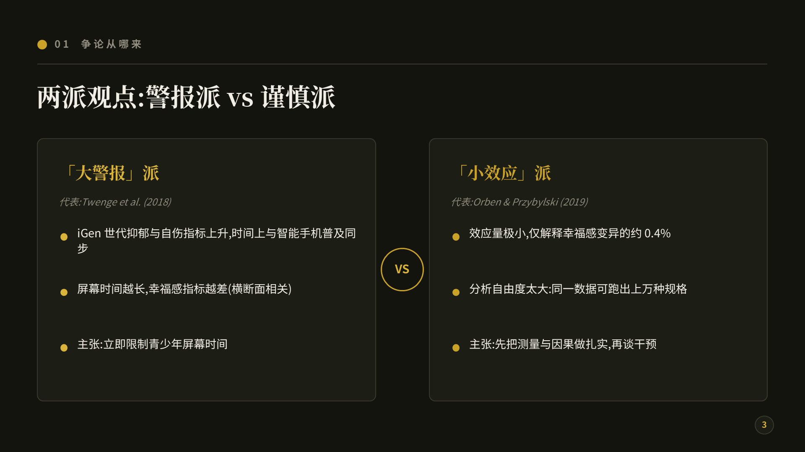

# slide-polish · 汇报 PPT 版式抛光 skill

> 把汇报 PPT 的版式交给 AI 重排，**内容一个字不动**。
> 这是本仓库第一个 **skill**——不是软件，是给 AI 的一份「带规矩的说明书」，复制即装、粘贴即用。

---

## 这是什么 / 给谁用

组会、文献汇报、项目汇报的 PPT，内容明明没问题，放上去就是丑：字挤成墙、没有重点、默认模板蓝。直接让 AI「美化一下」，它又常自作主张改措辞、挪数字。

**slide-polish 专治这个。** 它把「怎么让 PPT 顺眼」固化成 4 条铁律 ＋ 8 条设计规范 ＋ 一套分支工作流，写在 [`SKILL.md`](./SKILL.md) 里。装上之后，你的 AI 每次都会自动遵守：**只重排版式，绝不碰你的内容、数据、结论**——缺数据它会留空让你填，而不是编一个。

适合：所有要做汇报／演示 PPT 的人。**不需要你会写代码。**

## 用法①：有 AI agent（Claude Code / Codex 等）🔌

把下面这句话原样发给你的 agent：

> 请安装一个 GitHub skill：仓库是 HUIHUI59/openScientificTool，skill 在 skills/slide-polish 目录。把该目录复制到你的 skills 目录（如 `~/.claude/skills/slide-polish`），装好后我新开窗口使用。

装好后这样用：

> 用 slide-polish 把下面的汇报内容排成专业的 PPT 版式：【粘贴你的大纲】

## 用法②：没有 agent，任意网页 AI 也行 💬

把 [`SKILL.md`](./SKILL.md) **全文复制**，粘贴给 ChatGPT／Claude／豆包等任意对话框，再补一句：

> 用以上规则帮我重排下面的汇报内容：【粘贴你的大纲】

效果一致——skill 本质就是一份说明书。**一次喂一页（或一小节）效果最稳。**

## 能得到什么效果

- **默认**：AI 逐页输出「标题／要点分块／视觉建议」的版式方案，你到 PowerPoint／WPS 里照着套；
- **进阶（环境有 Node.js）**：AI 直接用 pptxgenjs 写代码生成真 .pptx 文件。参考实现见 [`scripts/demo.js`](./scripts/demo.js)——`npm install pptxgenjs` 后 `node demo.js` 就能跑出一份深墨绿配色、大字留白的两页示例（demo 里的文献与数字真实可查：Orben & Przybylski 2019, *Nature Human Behaviour*）。

## 示例效果

用本 skill 排出的一份 10 页组会汇报（完整效果图在 [`examples/`](./examples)，成品文件在 [`scripts/demo-deck.pptx`](./scripts/demo-deck.pptx)）：

**封面页**——大标题＋留白，信息位留空待填：


**两栏对比页**——两派观点左右对照，中间 VS 视觉锚点：



**编号卡片页**——四个要点分块成卡，一眼看清结构：


## 目录结构

```text
slide-polish/
├── SKILL.md            # skill 本体:铁律 + 8 条设计规范 + 工作流(粘贴给 AI 的就是它)
├── README.md           # 本文件 · 说明书
├── examples/           # 示例效果图(page-1 ~ page-10, 上面「示例效果」小节的出处)
└── scripts/
    ├── demo.js         # pptxgenjs 参考实现(封面 + 大数字内容页,注释对应规范条目)
    └── demo-deck.pptx  # demo 跑出来的成品,可直接下载打开看效果
```

## 理念（HITL，人在回路）

AI 只管版式和好看，**内容、数据、结论永远是你自己的**——这条护栏直接焊死在 SKILL.md 铁律区。交付前请逐页对着原稿核一遍再用。

## License

[Apache-2.0](../../LICENSE)（同仓库根）。随便用、随便改，记得保留版权声明就行。
